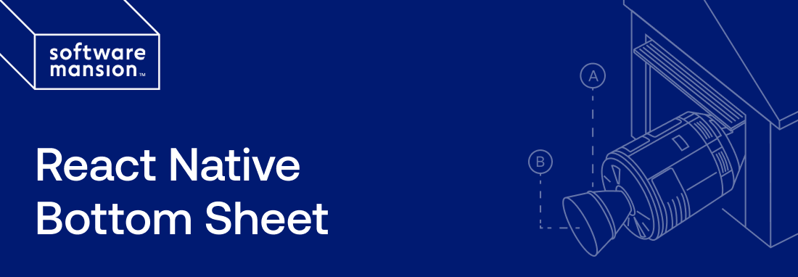

# React Native Bottom Sheet




React Native Bottom Sheet provides bottom&zwj;-&zwj;sheet components for
React&nbsp;Native.

## Getting started

1. Install React Native Bottom&nbsp;Sheet:

   ```sh
   npm i @swmansion/react-native-bottom-sheet
   ```

2. Ensure the peer dependencies are&nbsp;installed:

   ```sh
   npm i react-native-gesture-handler@^2.14.0 react-native-reanimated@^3.16.0 react-native-safe-area-context@^4.0.0 react-native-worklets@^0.4.0
   ```

3. Wrap your app with `GestureHandlerRootView` and&nbsp;`BottomSheetProvider`:

   ```tsx
   const App = () => (
     <GestureHandlerRootView>
       <BottomSheetProvider>{/* ... */}</BottomSheetProvider>
     </GestureHandlerRootView>
   );
   ```

## Usage

The library provides two components: `BottomSheet` (inline) and
`ModalBottomSheet` (modal). Both render their children as the sheet content
(including any background) and are controlled via `detents`, `index`,
and&nbsp;`onIndexChange`.

### Inline

`BottomSheet` renders within your screen&nbsp;layout.

```tsx
const [index, setIndex] = useState(0);
const insets = useSafeAreaInsets();
```

```tsx
<BottomSheet index={index} onIndexChange={setIndex}>
  <View
    style={{
      backgroundColor: 'white',
      padding: 16,
      paddingBottom: insets.bottom + 16,
    }}
  >
    <Text>Sheet content</Text>
  </View>
</BottomSheet>
```

### Modal

`ModalBottomSheet` renders above other content with a&nbsp;scrim.

```tsx
const [index, setIndex] = useState(0);
const insets = useSafeAreaInsets();
```

```tsx
<ModalBottomSheet index={index} onIndexChange={setIndex}>
  <View
    style={{
      backgroundColor: 'white',
      padding: 16,
      paddingBottom: insets.bottom + 16,
    }}
  >
    <Text>Sheet content</Text>
  </View>
</ModalBottomSheet>
```

#### Scrim

Tapping the scrim collapses the sheet. You can provide a custom scrim via the
`scrim` prop, which receives a `SharedValue` that goes from 0 when collapsed to
1 when the first nonzero detent is&nbsp;reached:

```tsx
<ModalBottomSheet
  index={index}
  onIndexChange={setIndex}
  scrim={(progress) => (
    <Animated.View
      style={useAnimatedStyle(() => ({
        backgroundColor: `rgba(0, 0, 255, ${0.3 * progress.value})`,
        flex: 1,
      }))}
    />
  )}
>
  {/* ... */}
</ModalBottomSheet>
```

### Detents and index

Detents are the points to which the sheet snaps. Each detent is either a number
(a fixed height in pixels) or `'max'` (the sheet’s content height, capped by the
available screen height). The default detents are `[0, 'max']`.

The `index` prop is a zero&zwj;-&zwj;based index into the `detents` array.
`onIndexChange` is called when the sheet snaps to a different detent after
a&nbsp;drag.

```tsx
const [index, setIndex] = useState(0);
```

```tsx
<BottomSheet // Or `ModalBottomSheet`.
  detents={[0, 300, 'max']} // Collapsed, 300 px, content height.
  index={index}
  onIndexChange={setIndex}
>
  {/* ... */}
</BottomSheet>
```

### Position tracking

The `position` prop accepts a `SharedValue` that the library keeps in sync with
the sheet’s current position (the distance in pixels from the bottom of the
screen to the top of the sheet). Use it to drive animations tied to the
sheet&nbsp;position.

```tsx
const position = useSharedValue(0);
```

```tsx
<BottomSheet // Or `ModalBottomSheet`.
  index={index}
  onIndexChange={setIndex}
  position={position}
>
  {/* ... */}
</BottomSheet>
```

### Scrollable content

For scrollable sheet content, use `BottomSheetScrollView` or
`BottomSheetFlatList` instead of the standard React Native components. These
integrate scrolling with the sheet’s drag gesture so that dragging down while
scrolled to the top collapses the&nbsp;sheet.

## By [Software Mansion](https://swmansion.com)

Founded in 2012, [Software Mansion](https://swmansion.com) is a software agency
with experience in building web and mobile apps. We are core React Native
contributors and experts in dealing with all kinds of React Native issues. We
can help you build your next dream
product&zwj;—&zwj;[hire&nbsp;us](https://swmansion.com/contact/projects?utm_source=react-native-bottom-sheet&utm_medium=readme).

[](https://swmansion.com)

[](https://github.com/software-mansion-labs/react-native-bottom-sheet/graphs/contributors)
