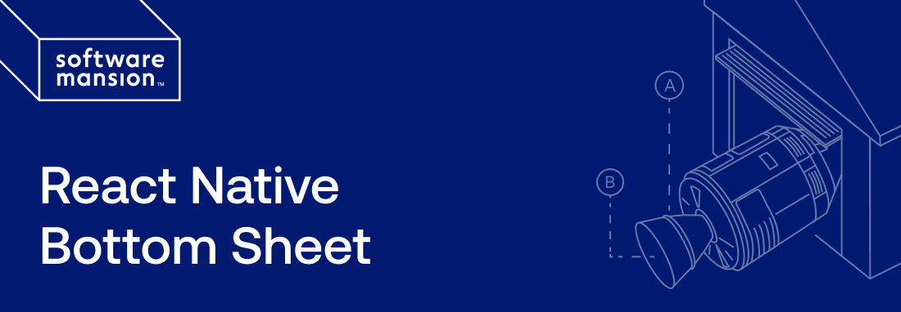

# React Native Bottom Sheet




React Native Bottom Sheet provides bottom&zwj;-&zwj;sheet components for
React&nbsp;Native.

## Highlights

- Native implementation for optimal&nbsp;performance.
- Both inline and modal sheet&nbsp;components.
- Bring your own sheet&nbsp;surface.
- Dynamic, content&zwj;-&zwj;based sizing out of the&nbsp;box.
- Automatic handling of vertically scrollable&nbsp;children.
- Position tracking for driving UI tied to&nbsp;sheets.
- Programmatic&zwj;-&zwj;only detents for snap points unreachable
  by&nbsp;dragging.

## How it compares

React Native already has strong bottom&zwj;-&zwj;sheet options, but they make
different tradeoffs. React Native Bottom Sheet gives you composable React Native
primitives backed by native sheet mechanics: You compose the surface in React,
while the sheet host, gestures, snapping, and scroll negotiation run in
native&nbsp;code.

[`@gorhom/bottom-sheet`](https://gorhom.dev/react-native-bottom-sheet) is the
closest match in day&zwj;-&zwj;to&zwj;-&zwj;day functionality: configurable
detents, dynamic sizing, scrollable coordination, inline sheets, and modal
presentation. The main difference is the implementation model. React Native
Bottom Sheet moves the sheet host, gestures, snapping, and scroll negotiation
into native code, so heavy React rendering and busy JS work are less likely to
affect drag and snap performance. It also does not require Reanimated or React
Native Gesture Handler. Because scroll coordination is native, regular React
Native scrollables work inside the sheet without
bottom&zwj;-&zwj;sheet&zwj;-&zwj;specific list components or wrapper factories.

[Expo UI](https://docs.expo.dev/versions/latest/sdk/ui) sheets,
[Expo Router form sheets](https://docs.expo.dev/router/advanced/modals/#form-sheet),
and native modal&zwj;-&zwj;sheet libraries such as
[True Sheet](https://sheet.lodev09.com) lean into platform presentation APIs.
That is a good fit when you want a system&zwj;-&zwj;style presented sheet, but
it also means the platform and presentation system decide more of the behavior.
React Native Bottom Sheet is built as a lower&zwj;-&zwj;level sheet primitive
instead: The same native implementation powers both persistent inline sheets and
modal sheets, you provide the complete sheet surface in React, and detents can
include app&zwj;-&zwj;level behavior such as programmatic&zwj;-&zwj;only
snap&nbsp;points.

That difference also matters for layering. A platform&zwj;-&zwj;presented sheet
can disable dimming and allow background interaction, but it is still drawn as a
presented native sheet over the React Native view hierarchy. `BottomSheet` is
actually inline: It renders in your screen’s React Native hierarchy and can be
layered alongside nearby content. When you do need a modal, `ModalBottomSheet`
is rendered through `BottomSheetProvider`’s portal rather than through a
separate native window, so global UI such as toasts, menus, floating controls,
or debug overlays can be arranged above or below it by where you place them
relative to the&nbsp;provider.

## Getting started

1. Install React Native Bottom&nbsp;Sheet:

   ```sh
   npm i @swmansion/react-native-bottom-sheet
   ```

2. Ensure the peer dependency is&nbsp;installed:

   ```sh
   npm i react-native-safe-area-context
   ```

3. Wrap your app with&nbsp;`BottomSheetProvider`:

   ```tsx
   const App = () => <BottomSheetProvider>{/* ... */}</BottomSheetProvider>;
   ```

## Usage

The library provides two components: `BottomSheet` (inline) and
`ModalBottomSheet` (modal). Both render their children as the sheet content,
with a `surface` prop for the background behind it, and are controlled via
`detents`, `index`, and&nbsp;`onIndexChange`. Use `onSettle` to observe when the
sheet finishes&nbsp;moving.

### Inline

`BottomSheet` renders within your screen&nbsp;layout.

```tsx
const [index, setIndex] = useState(0);
const insets = useSafeAreaInsets();
```

```tsx
<BottomSheet
  index={index}
  onIndexChange={setIndex}
  surface={
    <View style={[StyleSheet.absoluteFill, { backgroundColor: 'white' }]} />
  }
>
  <View style={{ padding: 16, paddingBottom: insets.bottom + 16 }}>
    <Text>Sheet content</Text>
  </View>
</BottomSheet>
```

### Modal

`ModalBottomSheet` renders above other content with an optional scrim
(transparent by&nbsp;default).

```tsx
const [index, setIndex] = useState(0);
const insets = useSafeAreaInsets();
```

```tsx
<ModalBottomSheet
  index={index}
  onIndexChange={setIndex}
  surface={
    <View style={[StyleSheet.absoluteFill, { backgroundColor: 'white' }]} />
  }
>
  <View style={{ padding: 16, paddingBottom: insets.bottom + 16 }}>
    <Text>Sheet content</Text>
  </View>
</ModalBottomSheet>
```

#### Scrim

Tapping the scrim collapses the sheet. Use `scrimColor` to customize
its&nbsp;color:

```tsx
<ModalBottomSheet
  index={index}
  onIndexChange={setIndex}
  surface={/* ... */}
  scrimColor="rgba(0, 0, 0, 0.3)"
>
  {/* ... */}
</ModalBottomSheet>
```

By default, the scrim fades in as the sheet opens and then holds at full
opacity, so detents above the first share the same scrim. Use `scrimOpacities`
to control the opacity at each detent: It takes one value in 0–1 per detent,
indexed to match `detents`, and interpolates linearly as the sheet is dragged
between them. A shorter array reuses its last value for any remaining detents.

The default maps each detent to 0 when it is closed and 1 otherwise, so the
scrim is transparent at any closed detent and fully opaque at every open one,
whatever order the detents are passed in.

To keep the scrim deepening across every detent, pass one value per detent:

```tsx
<ModalBottomSheet
  index={index}
  onIndexChange={setIndex}
  detents={[0, 300, 'content']}
  scrimColor="rgba(0, 0, 0, 0.3)"
  scrimOpacities={[0, 0.5, 1]}
  surface={/* ... */}
>
  {/* ... */}
</ModalBottomSheet>
```

### Surface

Provide the sheet’s background through the `surface` prop. The library renders
it behind your content and sizes it natively to cover the whole sheet,
independently of the content&nbsp;height.

Decoupling the surface this way keeps the sheet covered as the content height
changes. When content shrinks, the sheet animates to its new height without the
background briefly exposing blank space behind the&nbsp;content.

Give the surface a filling style such as `StyleSheet.absoluteFill`. It is
mounted in a full&zwj;-&zwj;size host, so a surface sized only by its own
content would collapse and not&nbsp;show.

```tsx
<BottomSheet // Or `ModalBottomSheet`.
  index={index}
  onIndexChange={setIndex}
  surface={
    <View style={[StyleSheet.absoluteFill, { backgroundColor: 'white' }]} />
  }
>
  <Text>Sheet content</Text>
</BottomSheet>
```

### Scrollable negotiation

By default, the sheet coordinates vertical gestures with nested scrollables,
such as `ScrollView` and&nbsp;`FlatList`.

If you want gestures that start inside a nested scrollable to stay with that
scrollable even when it cannot scroll any further,
set&nbsp;`disableScrollableNegotiation`:

```tsx
<BottomSheet
  index={index}
  onIndexChange={setIndex}
  surface={/* ... */}
  disableScrollableNegotiation
>
  {/* ... */}
</BottomSheet>
```

### Detents and index

Detents are the points to which the sheet snaps. Each detent is either a number
(a fixed height in pixels) or `'content'` (the sheet’s content height, capped by
the available screen height). The default detents are `[0, 'content']`.

Sheet children are laid out in a flex container. For a full&zwj;-&zwj;height
sheet, apply `flex: 1` to your content and use the `'content'`&nbsp;detent.
`surface` is sized by the library, so `flex: 1` only ever belongs on your
content, never on the&nbsp;surface:

```tsx
<BottomSheet
  // `detents` defaults to `[0, 'content']`.
  index={index}
  onIndexChange={setIndex}
  surface={
    <View style={[StyleSheet.absoluteFill, { backgroundColor: 'white' }]} />
  }
>
  <View style={{ flex: 1 }}>{/* Full-height sheet content. */}</View>
</BottomSheet>
```

The `index` prop is a zero&zwj;-&zwj;based index into the `detents` array.
`onIndexChange` and `onSettle` have different&nbsp;responsibilities:

- `onIndexChange` fires when a user&zwj;-&zwj;triggered snap is _initiated_: the
  moment a drag commits to a detent, before the animation settles. It does not
  fire for programmatic `index` changes; you already know when you make those.
  Treat it as the signal to update your controlled `index`&nbsp;state.
- `onSettle` fires when the sheet finishes snapping to a detent, regardless of
  whether that snap was user&zwj;-&zwj;triggered or programmatic. It is the
  signal for the _end_ of any movement. Use it for observability or side effects
  (analytics, reacting to collapse, etc.), not for updating the controlled
  `index`&nbsp;state.

```tsx
const [index, setIndex] = useState(0);
```

```tsx
<BottomSheet // Or `ModalBottomSheet`.
  detents={[0, 300, 'content']} // Collapsed, 300 px, content height.
  index={index}
  onIndexChange={setIndex} // Fires when a drag commits; keep state in sync.
  surface={/* ... */}
  onSettle={(nextIndex) => {
    if (nextIndex === 0) console.log('Sheet finished collapsing.');
  }}
>
  {/* ... */}
</BottomSheet>
```

Detents can also change over time. When you update `detents`, the sheet keeps
the current index and animates to the updated detent height when needed.

#### Programmatic-only detents

If you want a detent to be reachable only via code (not by dragging), use the
object form or the `programmatic` helper. Programmatic detents are excluded from
drag snapping but can still be targeted via `index`&nbsp;updates.

```tsx
<BottomSheet
  detents={[0, programmatic(300), 'content']}
  index={index}
  onIndexChange={setIndex}
  surface={/* ... */}
  onSettle={(nextIndex) => {
    console.log(`Settled at ${nextIndex}.`);
  }}
>
  {/* ... */}
</BottomSheet>
```

### Position tracking

Use `onPositionChange` to observe the sheet’s current position. It is a standard
native event; read the distance in pixels from the bottom of the screen to the
top of the sheet from&nbsp;`event.nativeEvent.position`. The same event also
carries `event.nativeEvent.index`—the fractional detent index in
`0..(detents.length - 1)` (`0` at the shortest detent, `1` at the next, and so
on, interpolated in between)—the continuous counterpart of `onIndexChange`,
handy for driving a backdrop or per-detent animation without knowing the
sheet’s height.

```tsx
<BottomSheet // Or `ModalBottomSheet`.
  index={index}
  onIndexChange={setIndex}
  surface={/* ... */}
  onPositionChange={(event) => {
    console.log(event.nativeEvent.position, event.nativeEvent.index);
  }}
>
  {/* ... */}
</BottomSheet>
```

#### With Reanimated

To keep the latest position in a Reanimated shared value, update it from
the&nbsp;callback:

```tsx
const position = useSharedValue(0);
```

```tsx
<BottomSheet
  index={index}
  onIndexChange={setIndex}
  surface={/* ... */}
  onPositionChange={(event) => {
    position.value = event.nativeEvent.position;
  }}
>
  {/* ... */}
</BottomSheet>
```

Because `onPositionChange` is a native event, you can also handle it on the UI
thread. Pass `Animated.createAnimatedComponent` to `wrapNativeView`—the library
applies it to the native sheet view—and give `onPositionChange` a worklet
handler from&nbsp;`useEvent`:

```tsx
import type { NativeSyntheticEvent } from 'react-native';
import Animated, { useEvent, useSharedValue } from 'react-native-reanimated';
import {
  BottomSheet,
  type PositionChangeEventData,
} from '@swmansion/react-native-bottom-sheet';
```

```tsx
const position = useSharedValue(0);
const detentIndex = useSharedValue(0);

const onPositionChange = useEvent<
  NativeSyntheticEvent<PositionChangeEventData>
>(
  (event) => {
    'worklet';
    position.value = event.position;
    detentIndex.value = event.index;
  },
  ['onPositionChange']
);
```

```tsx
<BottomSheet // Or `ModalBottomSheet`.
  index={index}
  onIndexChange={setIndex}
  surface={/* ... */}
  wrapNativeView={Animated.createAnimatedComponent}
  onPositionChange={onPositionChange}
>
  {/* ... */}
</BottomSheet>
```

`wrapNativeView` keeps the animated wrapper on the native sheet view itself, so
the worklet binds on first render—for both inline and modal sheets—without the
library depending on Reanimated. Pass a stable function (such as
`Animated.createAnimatedComponent`), not an inline lambda.

Inside the worklet, Reanimated unwraps the native event, so you read
`event.position` directly rather than `event.nativeEvent.position`. The handler
runs on the UI thread on every frame the sheet&nbsp;moves.

## By [Software Mansion](https://swmansion.com)

Founded in 2012, [Software Mansion](https://swmansion.com) is a software agency
with experience in building web and mobile apps. We are core React Native
contributors and experts in dealing with all kinds of React Native issues. We
can help you build your next dream
product&zwj;—&zwj;[hire&nbsp;us](https://swmansion.com/contact/projects?utm_source=react-native-bottom-sheet&utm_medium=readme).

[](https://swmansion.com)

## Sponsored by [Gobi Maps](https://www.gobimaps.com)

The best of your city, all in one&nbsp;map.

[](https://www.gobimaps.com)
